# HackerRank Orchestrate — Multi-Modal Damage Claim Verification

A hybrid **Vision-Language Model + Rule Engine** system that verifies damage claims using submitted images, claim conversations, user history, and minimum evidence requirements. Built for the HackerRank Orchestrate 24-hour hackathon.

**Object types:** cars, laptops, packages  
**Output:** structured CSV predictions (`supported` / `contradicted` / `not_enough_information`) with risk flags, severity, and evidence justifications

---

## Problem Statement

Insurance and e-commerce platforms receive thousands of damage claims daily. Each claim includes images, a short conversation transcript, user claim history, and minimum image evidence requirements. Manually reviewing every claim is expensive and slow. An automated system must:

1. Extract the actual damage claim from the conversation
2. Inspect submitted images for visual evidence
3. Determine if evidence supports, contradicts, or is insufficient
4. Flag image quality issues, mismatch risks, or user history concerns
5. Estimate severity and produce grounded justifications

See [`problem_statement.md`](./problem_statement.md) for the full specification.

---

## Solution Overview

The system uses a **three-tier reliability architecture**:

| Tier | Component | When Active |
|------|-----------|-------------|
| Primary | Gemini 2.5 Flash VLM | API key configured, quota available |
| Rule Layer | 10 consistency rules + confidence gates | Always, as post-processor |
| Fallback | Deterministic keyword engine | VLM unavailable (no key, quota exhausted) |

**Design philosophy:** The VLM handles visual understanding (what is visible in images). The rule engine handles deterministic logic (severity constraints, cross-field consistency, evidence requirement validation). This separation keeps each component testable and replaceable.

---

## Key Features

- **Dual inference strategies:** Single-pass VLM (Strategy A) vs. structured observations + rules (Strategy B)
- **Confidence-based gating:** 4-tier confidence handling (pass-through, flag, NEI, full unknown)
- **10 cross-field consistency rules:** Enforces valid combinations of severity, issue_type, claim_status
- **Keyword-based issue correction:** `visible_damage` text matched against damage keyword table to fix VLM hallucinations
- **Evidence requirement validation:** 12 structured rules from CSV checked per claim
- **Contradiction detection:** Automatic supported→contradicted override on mismatch flags
- **Text instruction detection:** Identifies claims where user text attempts to override reviewer instructions
- **User history integration:** Risk flags derived from past claim patterns
- **Multi-provider VLM support:** Gemini, OpenAI, Anthropic via abstract base class
- **Graceful fallback:** Zero-API keyword extraction when VLM is unavailable
- **Telemetry tracking:** Token counts, runtime, cost estimates, confidence scores
- **Evaluation pipeline:** Per-field accuracy, confusion matrix, strategy comparison, markdown report

---

## System Architecture

```mermaid
graph TB
    subgraph Input["Input Layer"]
        A1[claims.csv] --> A2[ClaimInput Parser]
        A3[user_history.csv] --> A4[HistoryLookup]
        A5[evidence_requirements.csv] --> A6[EvidenceRequirementChecker]
        A7[prompts/*.txt] --> A8[Prompt Loader]
    end

    subgraph Routing["Strategy Router"]
        B1{vlm_health_check?}
        B1 -- Yes --> B2[Strategy A]
        B1 -- Yes --> B3[Strategy B]
        B1 -- No --> B4[FallbackEngine]
    end

    subgraph VLM_Layer["VLM Layer"]
        C1[VLMClient Base] --> C2[GeminiClient]
        C1 --> C3[OpenAIClient]
        C1 --> C4[AnthropicClient]
        C2 --> C5[VLMOutput<br/>5 observation fields]
    end

    subgraph Rule_Layer["Rule Engine Layer"]
        D1[confidence_fallback] --> D2[fix_issue_type_from_visible_damage]
        D2 --> D3[derive_risk_flags]
        D3 --> D4[evidence_check]
        D4 --> D5[apply_consistency_rules]
        D5 --> D6[fix_severity]
    end

    subgraph Fallback_Layer["Fallback Layer"]
        E1[Last-Customer-Statement Parser]
        E2[Keyword Issue Extractor]
        E3[Keyword Part Extractor]
        E4[Text Instruction Detector]
        E1 --> E2 --> E5[VLMOutput<br/>with confidence=0.35]
        E3 --> E5
        E4 --> E5
        E5 --> Rule_Layer
    end

    subgraph Output["Output Layer"]
        F1[FinalOutput Builder]
        F2[CSV Writer]
        F1 --> F2 --> F3[output.csv<br/>14 columns]
    end

    subgraph Evaluation["Evaluation Layer"]
        G1[Sample Claims Loader]
        G2[Metrics Calculator]
        G3[Confusion Matrix]
        G4[Strategy Comparator]
        G5[Report Generator]
        G1 --> G2 --> G3 --> G4 --> G5
    end

    A2 --> Routing
    A4 --> Rule_Layer
    A6 --> Rule_Layer
    A8 --> VLM_Layer
    B2 --> VLM_Layer --> Rule_Layer
    B3 --> VLM_Layer --> Rule_Layer
    B4 --> Fallback_Layer
    Rule_Layer --> Output
    Output --> Evaluation
```



### Input Pipeline

Claims are loaded from `dataset/claims.csv` (44 test rows) or `dataset/sample_claims.csv` (20 labeled rows). Each row is parsed into a `ClaimInput` object with four fields: `user_id`, `image_paths`, `user_claim`, and `claim_object`. Image paths are resolved to absolute paths relative to the dataset directory. Image IDs are extracted from filenames (e.g., `img_1.jpg` → `img_1`).

### Data Processing Pipeline

1. **History Lookup:** `HistoryLookup` loads `user_history.csv` into a dict keyed by `user_id`, providing risk flags, past claim counts, and manual review requirements
2. **Evidence Requirements:** `EvidenceRequirementChecker` loads 12 structured rules, matching by `claim_object` (car/laptop/package/all) and `applies_to` (issue family)
3. **Claim Input:** One `ClaimInput` per CSV row, with `image_path_list` derived from semicolon-separated paths

### Prompt Generation Pipeline

Two prompt templates in `code/prompts/`:
- **`strategy_a.txt`:** Instructs the VLM to produce all 14 output fields in a single JSON response (end-to-end)
- **`strategy_b.txt`:** Instructs the VLM to produce 5 core observation fields + issue_type, object_part, claim_status, severity, confidence. The rule engine derives the remaining 9 fields

Both templates use `{user_claim}` and `{claim_object}` placeholders, filled at inference time. The image ID list is appended as additional context.

### Model Inference Layer

The `VLMClient` abstract base class defines:
- `predict_strategy_b(claim, prompt) → VLMOutput` — structured observations
- `predict_strategy_a(claim, prompt) → VLMOutputStrategyA` — end-to-end output
- `_call_api(prompt, images, schema) → (raw_json, input_tokens, output_tokens)` — provider-specific

`GeminiClient` implements `_call_api` using `google-genai` with:
- JSON schema enforcement via `response_mime_type` and `response_schema`
- Rate-limit handling: exponential backoff for 429 (quota), 503 (overload), and 400 errors
- PIL image loading from file paths
- Minimum 12-second inter-request delay for quota management
- 8 retry attempts with increasing wait times

### Post-Processing Layer

The `RuleEngine` applies in sequence:
1. **Issue type correction:** Tokenizes `visible_damage` text and scores against 11 damage keyword tables
2. **Object part correction:** Uses `visible_part` if `object_part` is unknown
3. **Risk flag derivation:** Image quality map (blurry, low_light, cropped) and logic flags (damage_not_visible, wrong_object)
4. **Confidence fallback:** 4 tiers — ≥0.8 pass, 0.6–0.8 flag, 0.3–0.6 NEI+flag, <0.3 full unknown
5. **Evidence requirement check:** Validates image evidence against 12 structured rules
6. **Claim status determination:** Evidence gates + contradiction overrides
7. **10 consistency rules:** Cross-field validation (e.g., NEI→evidence false, none→severity none)
8. **Severity constraints:** Per-issue-type floor/cap ranges
9. **Final output assembly:** 14-column CSV row with proper escaping

### Evaluation Layer

The evaluation pipeline:
1. Loads ground truth from `sample_claims.csv` (20 rows)
2. Runs both strategies through the same pipeline
3. Computes per-field accuracy (exact string match, set comparison for risk_flags)
4. Generates 3×3 confusion matrix for claim_status with precision/recall/F1
5. Compares Strategy A vs. B with difference metrics
6. Produces a markdown report at `evaluation/evaluation_report.md`

---

## End-to-End Execution Flow

```mermaid
flowchart LR
    A["claims.csv<br/>44 rows"] --> B["load_claims()<br/>CSV DictReader"]
    B --> C{Strategy?}
    C -->|a| D["load_prompt(strategy_a.txt)"]
    C -->|b| D2["load_prompt(strategy_b.txt)"]
    C -->|fallback| F["vlm_health_check()<br/>returns False"]
    D --> E["get_vlm_client()<br/>Gemini/OpenAI/Anthropic"]
    D2 --> E
    E --> G["For each claim:"]
    G --> H["resolve_image_paths()<br/>relative → absolute"]
    H --> I["predict_strategy_b()<br/>VLM API call"]
    I --> J["JSON parse → VLMOutput"]
    J --> K["constrain enums<br/>issue_type, object_part, claim_status, severity"]
    K --> L["RuleEngine.apply()"]
    L --> M["1. Fix issue from visible_damage"]
    M --> N["2. Fix object_part from visible_part"]
    N --> O["3. Derive risk_flags"]
    O --> P["4. Confidence fallback gate"]
    P --> Q["5. Add user history risk"]
    Q --> R["6. Check evidence_requirements.csv"]
    R --> S["7. Determine claim_status"]
    S --> T["8. Apply contradiction overrides"]
    T --> U["9. Fix severity"]
    U --> V["10. Apply 10 consistency rules"]
    V --> W["11. Build FinalOutput"]
    W --> X["write_output()<br/>CSV with escaping"]
    X --> Y["output.csv<br/>44 rows × 14 cols"]

    F --> Z["FallbackEngine"]
    Z --> AA["_all_customer_statements()<br/>parse last customer text"]
    AA --> AB["extract_pair()<br/>keyword scoring"]
    AB --> AC["_build_vlm()<br/>confidence=0.35"]
    AC --> AD["detect_text_instruction()"]
    AD --> AE["RuleEngine.apply()<br/>(same post-processing)"]
    AE --> AF["_post_process()<br/>set evidence=true for most"]
    AF --> Y
```



### Detailed Walkthrough

1. **Entry (`main()`):** Reads `strategy` from CLI args (default "b"). Calls `vlm_health_check()` — returns False if no API key is configured.
2. **Strategy selection:** If VLM is available, routes to `run_strategy()` → `process_strategy_b()`. Otherwise, routes to `run_fallback_pipeline()`.
3. **VLM pipeline:** For each claim, loads a VLM client, resolves image paths, calls `predict_strategy_b()`, constrains enums, applies `RuleEngine`, writes output.
4. **Fallback pipeline:** For each claim, parses the conversation text, extracts issue/part via keyword scoring, builds a `VLMOutput` with `confidence=0.35`, applies the same `RuleEngine`, then post-processes for evidence and severity overrides.
5. **Output:** All results written to `output.csv` with proper CSV escaping.

---

## Repository Structure

```
.
├── AGENTS.md                         # Agent configuration + log rules
├── README.md                         # This file
├── problem_statement.md              # Full task specification
├── opencode.json                     # MCP server config for aistudio
├── .gitignore
├── output.csv                        # Generated predictions (44 rows)
│
├── code/                             # Solution implementation
│   ├── README.md                     # Architecture, setup, usage
│   ├── main.py                       # Entry point — CLI dispatcher
│   ├── config.py                     # Paths + env-var configuration
│   ├── requirements.txt              # Python dependencies
│   │
│   ├── models/                       # Data models
│   │   ├── __init__.py
│   │   ├── enums.py                  # IssueType, ClaimStatus, Severity, RiskFlagType, ObjectPart enums
│   │   └── schemas.py                # ClaimInput, VLMOutput, FinalOutput, constraint functions
│   │
│   ├── vlm/                          # VLM integration
│   │   ├── __init__.py
│   │   ├── base.py                   # VLMClient abstract base class
│   │   ├── gemini_client.py          # Gemini implementation with rate-limit retry
│   │   ├── openai_client.py          # OpenAI implementation
│   │   └── anthropic_client.py       # Anthropic implementation
│   │
│   ├── fallback/                     # Zero-API fallback
│   │   ├── __init__.py
│   │   ├── engine.py                 # FallbackEngine orchestration + post-processing
│   │   ├── extractor.py              # Text-only claim parser (keyword matching)
│   │   └── mappings.py               # Keyword tables for 11 issue types, 3 object types
│   │
│   ├── engine/                       # Business logic
│   │   ├── __init__.py
│   │   ├── history.py                # HistoryLookup — user risk query
│   │   └── rule_engine.py            # RuleEngine — 10 rules, confidence, evidence checks
│   │
│   ├── telemetry/                    # Observability
│   │   ├── __init__.py
│   │   └── tracker.py                # TelemetryTracker — tokens, runtime, cost, confidence
│   │
│   ├── evaluation/                   # Evaluation pipeline
│   │   ├── __init__.py
│   │   ├── main.py                   # Evaluation entry point
│   │   ├── metrics.py                # Per-field accuracy, confusion matrix
│   │   ├── comparator.py             # Strategy A vs B comparison
│   │   └── report_generator.py       # Markdown report generation
│   │
│   └── prompts/                      # VLM prompts
│       ├── strategy_a.txt            # Single-pass prompt
│       └── strategy_b.txt            # Structured observations prompt
│
├── evaluation/
│   └── evaluation_report.md          # Generated performance report
│
└── dataset/
    ├── sample_claims.csv             # 20 labeled examples for development
    ├── claims.csv                    # 44 unlabeled test claims
    ├── user_history.csv              # 47 users with risk profiles
    ├── evidence_requirements.csv     # 12 minimum evidence rules
    └── images/
        ├── sample/                   # Sample images (20+ files)
        └── test/                     # Test images (82+ files)
```

---

## Technical Design

### Design Patterns

| Pattern | Usage |
|---------|-------|
| **Strategy Pattern** | `process_strategy_a()` vs `process_strategy_b()` — interchangeable inference strategies |
| **Template Method** | `VLMClient` abstract base defines `predict_strategy_b()`, subclasses implement `_call_api()` |
| **Chain of Responsibility** | `RuleEngine.apply()` chains 8 sequential transformations |
| **Builder** | `FinalOutput` assembled step by step from VLM observations + rule outputs |
| **Factory** | `get_vlm_client()` returns provider-specific client based on env var |

### Modular Structure

Each directory has a single responsibility:
- `models/` — data contracts (Pydantic schemas, enums, constraint functions)
- `vlm/` — provider-specific API wrappers
- `engine/` — deterministic business logic
- `fallback/` — VLM-independent text analysis
- `telemetry/` — observability without side effects
- `evaluation/` — validation and metrics

### Separation of Concerns

- **VLM output** contains only observations (what is visible), not decisions
- **Rule engine** contains only logic (what the observations mean), no API calls
- **Telemetry** is a passive tracker, not coupled to any processing pipeline
- **History lookup** is a read-only data access layer
- **Fallback** is a self-contained module with no VLM dependency

### Error Handling

- **JSON parse failure:** VLM response defaults to safe fallback values (`_default_strategy_b()`)
- **API rate limits:** Exponential backoff with 8 retries (429, 503, 400)
- **Missing API key:** Automatic fallback to deterministic engine
- **Missing files:** Graceful handling via `os.path.exists` checks
- **Invalid enums:** `constrain_*` functions map invalid values to safe defaults
- **Module import errors:** Client creation wrapped in try-catch

### Configuration Management

All configuration is centralized in `config.py`:
- **File paths:** Derived from `REPO_ROOT` — no hardcoded paths
- **API keys:** Read from environment variables only — never hardcoded
- **Model selection:** `VLM_PROVIDER` and `VLM_MODEL` env vars
- **Evidence rules:** Externalized to CSV — no hardcoded rules in code

---

## AI Pipeline

### Prompt Engineering Strategy

**Strategy A (Single-pass):** Instructs the model to output all 14 fields directly. Simpler but more prone to hallucination — the model must simultaneously evaluate evidence, determine severity, and assign risk flags.

**Strategy B (Structured observations):** The model outputs only 5 observation fields (`part_visible`, `damage_visible`, `image_quality`, `visible_damage`, `visible_part`) plus `issue_type`, `object_part`, `claim_status`, `severity`, and `confidence`. The rule engine derives the remaining 9 fields. This reduces hallucination because:
- The model answers factual questions (is it visible? what quality?) rather than judgment calls
- Rule-based severity constraints prevent impossible combinations (e.g., scratch→high)
- Risk flags are derived deterministically from observations

### Inference Workflow

1. **Template filling:** Prompt placeholders (`{user_claim}`, `{claim_object}`) replaced with claim data
2. **Image list injection:** Image IDs appended as context for `supporting_image_ids`
3. **Schema enforcement:** JSON schema sent as `response_schema` parameter — model output is constrained to valid JSON
4. **Raw response parsing:** JSON parsed with fallback to defaults on failure
5. **Enum constraint:** All string values validated against allowed enums
6. **Rule engine application:** 8-step deterministic post-processing
7. **Output assembly:** `FinalOutput` built from rule engine results

### Response Validation

- **JSON schema validation:** Gemini's `response_schema` enforces structure server-side
- **Enum validation:** `constrain_issue_type()`, `constrain_object_part()`, `constrain_claim_status()`, `constrain_severity()` ensure no invalid values
- **Risk flag validation:** Only 13 allowed flag values accepted; unknown flags dropped
- **Confidence bounds:** Clamped to [0, 1] range
- **Cross-field rules:** 10 consistency rules detect contradictory combinations (e.g., severity=none + issue_type=broken_part)

### Output Normalization

- **Alias resolution:** `constrain_object_part()` maps common aliases (mirror→side_mirror, packaging_seal→seal)
- **Fuzzy matching:** Levenshtein-like substring normalization for near-miss values
- **Semicolon separation:** `risk_flags` and `supporting_image_ids` joined from arrays
- **CSV escaping:** Built-in `esc()` function handles commas, quotes, newlines in cell values

---

## Evaluation Methodology

### Dataset Usage

| Dataset | Rows | Purpose |
|---------|------|---------|
| `sample_claims.csv` | 20 | Development — labeled inputs + expected outputs |
| `claims.csv` | 44 | Test — inputs only, system generates predictions |
| `user_history.csv` | 47 users | Risk context for all claims |
| `evidence_requirements.csv` | 12 rules | Minimum image evidence by object + issue type |

### Validation Approach

- **Per-field accuracy:** String comparison for each of 7 output fields (evidence_standard_met, risk_flags, issue_type, object_part, claim_status, valid_image, severity)
- **Set comparison for risk_flags:** Split-sort-compare to handle order-independent matching
- **Exact match:** All 7 fields must match simultaneously
- **Confusion matrix:** 3×3 matrix for claim_status with precision, recall, F1 per class

### Testing Procedure

```bash
# Run evaluation on sample set (20 claims)
python code/evaluation/main.py

# Run inference on test set (44 claims)
python code/main.py b      # VLM + Rules (recommended)
python code/main.py a      # Single-pass VLM
python code/main.py fallback  # No-API mode

# Run specific strategy
python code/main.py b
python code/main.py a
python code/main.py fallback
```

### Comparison Methodology

`Comparator.compare_strategies()` takes predictions from Strategy A and Strategy B, plus ground truth, and produces:
- Per-field accuracy for both strategies
- Percentage difference (B − A)
- Confusion matrices with per-class metrics

---

## Performance Analysis

The following results are from the **fallback evaluation** on 20 sample claims (VLM mode evaluation requires API access):

| Field | Accuracy | Correct / Total |
|-------|----------|-----------------|
| evidence_standard_met | 90.0% | 18/20 |
| object_part | 80.0% | 16/20 |
| valid_image | 90.0% | 18/20 |
| issue_type | 50.0% | 10/20 |
| severity | 50.0% | 10/20 |
| claim_status | 10.0% | 2/20 |
| risk_flags | 5.0% | 1/20 |
| exact_match | 0.0% | 0/20 |

*Note: Full VLM performance metrics are documented in `code/README.md` from earlier Gemini runs. The fallback mode is a degraded mode — it extracts what it can from text alone without image analysis. Claim_status accuracy is low because most sample claims expect "supported" or "contradicted" based on image evidence, which the text-only fallback cannot determine.*

---

## Scalability Considerations

- **Provider abstraction** allows swapping between Gemini, OpenAI, and Anthropic without code changes — useful for cost optimization across providers
- **Sequential processing** is sufficient for 44 claims; batch processing can be added for production volumes
- **Telemetry tracking** provides cost-per-claim data for budget planning
- **Evidence rules in CSV** means new claim types can be added without code changes
- **The rule engine is stateless** — can be deployed as a microservice or Lambda function
- **Confidence gating** enables human-in-the-loop: low-confidence claims auto-routed for manual review

---

## Reliability Features

- **Automatic fallback:** System detects missing API keys and switches to deterministic mode
- **Rate-limit resilience:** 8 retry attempts with exponential backoff for API throttling
- **Graceful degradation:** Each component has safe defaults — JSON parse failure, missing files, invalid values
- **Output verification:** Enum constraints ensure no invalid values reach the output CSV
- **Telemetry:** Runtime tracking enables identification of slow or failing claims
- **Deterministic rule engine:** Same inputs always produce same outputs — no randomness
- **Text instruction detection:** Claims with embedded instructions (e.g., "approve this claim") are flagged
- **User history integration:** High-risk users flagged even when image evidence is ambiguous

---

## Future Improvements

- **Multi-image aggregation:** Consider all images per claim collectively rather than sequentially
- **Caching layer:** Cache VLM responses for identical or similar images to reduce API costs
- **Confidence calibration:** Fine-tune confidence thresholds using evaluation feedback
- **Few-shot prompting:** Include labeled examples in the prompt for improved consistency
- **Vision-language fine-tuning:** Fine-tune a smaller model on the sample dataset for lower-cost inference
- **Explanation generation:** Use a separate LLM call to produce more detailed natural-language justifications
- **Incremental processing:** Support streaming or incremental addition of new claims
- **Web dashboard:** Visualize evaluation metrics and claim decisions interactively

---

## Setup Instructions

### Prerequisites

- Python 3.10+
- At least one VLM API key (Gemini, OpenAI, or Anthropic)

### Installation

```bash
# Clone the repository
git clone <repo-url> hackerrank-orchestrate
cd hackerrank-orchestrate

# Install dependencies
pip install google-genai Pillow pydantic
# Optional: pip install anthropic openai

# Verify setup
python code/main.py fallback  # Should generate output.csv
```

### Windows Notes

The code includes automatic path resolution for Windows Python user site-packages. No additional configuration needed.

---

## Environment Variables

| Variable | Required | Default | Description |
|----------|----------|---------|-------------|
| `GEMINI_API_KEY` | For Gemini | — | Google AI Studio API key |
| `GEMINI_MODEL` | No | `gemini-2.5-flash` | Gemini model name |
| `VLM_PROVIDER` | No | `gemini` | Provider: `gemini`, `openai`, `anthropic` |
| `VLM_MODEL` | No | `gemini-2.5-flash` | Model name for OpenAI/Anthropic |
| `OPENAI_API_KEY` | For OpenAI | — | OpenAI API key |
| `ANTHROPIC_API_KEY` | For Anthropic | — | Anthropic API key |

---

## Running Evaluation

```bash
# Evaluate on sample claims (20 rows)
python code/evaluation/main.py
```

Output: `evaluation/evaluation_report.md` with accuracy, confusion matrix, and telemetry.

### Sample Output

```
=== Fallback ===
  claim_status: 10.0% (2/20)
  evidence_standard_met: 90.0% (18/20)
  issue_type: 50.0% (10/20)
  object_part: 80.0% (16/20)
  severity: 50.0% (10/20)
  (Fallback mode - no VLM calls)
```

---

## Running Inference

```bash
# Strategy B — VLM + Rules (recommended)
python code/main.py b

# Strategy A — Single-pass VLM (baseline)
python code/main.py a

# Fallback mode — no API calls
python code/main.py fallback
```

Each command reads `dataset/claims.csv` and writes `output.csv`.

---

## Output Format

`output.csv` has 14 columns in this exact order:

| Column | Example | Description |
|--------|---------|-------------|
| `user_id` | `user_002` | Claimant identifier |
| `image_paths` | `images/test/case_001/img_1.jpg;...` | Semicolon-separated paths |
| `user_claim` | `Customer: ...` | Full conversation transcript |
| `claim_object` | `car` | Object type: car/laptop/package |
| `evidence_standard_met` | `true` | Whether image set is sufficient |
| `evidence_standard_met_reason` | `Claim text describes...` | Justification |
| `risk_flags` | `manual_review_required` | Semicolon-separated flags |
| `issue_type` | `dent` | Visible damage type |
| `object_part` | `door` | Affected part |
| `claim_status` | `not_enough_information` | Final decision |
| `claim_status_justification` | `Claim text indicates...` | Evidence explanation |
| `supporting_image_ids` | `none` | Image IDs supporting decision |
| `valid_image` | `true` | Whether images are usable |
| `severity` | `medium` | Estimated severity |

### Generated Artifacts

| File | Contents |
|------|----------|
| `output.csv` | Predictions for all 44 test claims |
| `evaluation/evaluation_report.md` | Performance report on 20 sample claims |
| `code/README.md` | Technical documentation |

---

## Testing

### Unit Testing Strategy

- **Schema validation:** `constrain_*` functions tested with valid, invalid, and boundary values
- **Enum domain:** All enum values explicitly listed — no reflection-based magic
- **CSV output:** `FinalOutput.csv_row()` and `csv_header()` tested for correct column order and escaping

### Integration Testing Strategy

- **End-to-end pipeline:** `python code/main.py fallback` generates a complete `output.csv` with 44 rows
- **Evaluation pipeline:** `python code/evaluation/main.py` compares predictions against ground truth
- **Health check:** `vlm_health_check()` verifies API key presence before VLM calls

### Validation Methodology

- **Row count:** Output must have exactly 44 rows (matching input)
- **Column count:** Exactly 14 columns in the specified order
- **Enum compliance:** All output values checked against allowed enums
- **Cross-field consistency:** Rules prevent contradictory combinations
- **Set comparison:** `risk_flags` compared as unordered sets (order-independent)

### Reproducibility

- **Deterministic fallback:** Same text input always produces same output
- **Rule engine:** No randomness — all decisions are deterministic
- **VLM mode:** `temperature=0.0` minimizes output variation
- **Seeded configuration:** All paths and environment variables are explicit

---

## Engineering Decisions

| Decision | Rationale |
|----------|-----------|
| **Hybrid VLM + Rules** | VLM handles visual understanding; rules handle deterministic logic. Each is testable independently |
| **Strategy separation** | Strategy A provides a baseline; Strategy B isolates rule engine improvements |
| **Abstract VLMClient** | Single `_call_api()` interface supports any provider — no vendor lock-in |
| **Enum-based output** | Strict enums prevent invalid values from reaching the CSV |
| **Confidence gates** | 4-tier handling provides graduated responses based on certainty |
| **CSV evidence rules** | 12 evidence requirements loaded from file, not hardcoded — extensible without code changes |
| **Fallback isolation** | Separate module with no VLM dependency — can operate in air-gapped environments |
| **Keyword-based extraction** | No ML dependencies for fallback — pure string matching with multilingual support |
| **Telemetry as passive tracker** | No processing impact — collects data without modifying pipeline behavior |

---

## Hackathon Highlights

1. **Three-tier reliability:** VLM → Rule Engine → Fallback creates a system that never fails silently. If the API is down, the system degrades gracefully rather than crashing.

2. **Structured observation prompting:** Strategy B reduces VLM hallucination by separating factual observations from judgment calls. The rule engine handles the reasoning.

3. **10 consistency rules:** Cross-field validation prevents impossible output combinations (scratch with high severity, NEI with supported status).

4. **Evidence requirement integration:** 12 structured rules loaded from CSV externalize business logic. Adding a new claim type means adding a CSV row, not writing code.

5. **Confidence-based gating:** Four-tier handling provides graduated responses — from pass-through (≥0.8) to full unknown (<0.3) with manual review flags at intermediate levels.

6. **Keyword-based issue correction:** VLM hallucination of damage types is corrected by matching `visible_damage` text against a 150+ keyword damage table.

7. **Multi-lingual fallback:** The deterministic engine supports English, Spanish, Hindi, and Chinese claim text through expanded keyword tables.

8. **Provider-agnostic design:** Abstract VLM client supports Gemini, OpenAI, and Anthropic. Switching providers requires changing one environment variable.
